# Bots (NodeJS)

## Overview
City Power & Light is a sample application that allows citizens to report "incidents" that have occurred in their community. It includes a landing screen, a dashboard, and a form for reporting new incidents with an optional photo. The application is implemented with several components:

* Front end web application contains the user interface and business logic. This component has been implemented three times in .NET, NodeJS, and Java.
* WebAPI is shared across the front ends and exposes the backend CosmosDB.
* CosmosDB is used as the data persistence layer.

In this lab, you will continue enhancing the overall City Power & Light experience by creating an incident reporting bot from scratch and via the Azure Bot Service and host it in Azure. The bot will be able to gather data from a user with an optional photo and submit it to the WebAPI.

> ***Bot development is currently only supported in C# and NodeJS. In this exercise we will mainly demonstrate the creation and deployment of bots which is independent of the used programming language and different bot capabilities. The actual bot will be created by the extensive use of the [FormFlow](https://docs.microsoft.com/en-us/bot-framework/dotnet/bot-builder-dotnet-formflow) template in C#. Changes to the code are minimal and do not require actual understanding of the C# language. It is important to see how the template is applied.***

## Objectives
In this hands-on lab, you will learn how to:
* Set up the developing environment to support the creation of bot applications.
* Create your own bot from scratch.
* Create your own bot using Azure Bot Service.
* Hosting your bot in Azure.

## Prerequisites
* The source for the starter app is located in the [start](start) folder. 
* The finished project is located in the [end](end) folder. 
* Deployed the starter ARM Template [HOL 1](../01-developer-environment).
* Completion of the [HOL 5](../05-arm-cd).

## Exercises
This hands-on-lab has the following exercises:
* [Exercise 1: Set up your environment](#ex1)
* [Exercise 2: Create an interactive dialog](#ex2)
* [Exercise 3: Integrate the API](#ex3)
* [Exercise 4: Send attachments to the bot](#ex4)
* [Exercise 5: Host your bot in Azure](#ex5)
* [Exercise 6: Azure Bot Service](#ex6) 

---
## Exercise 1: Set up your environment<a name="ex1"></a>

To develop a bot on your machine you need the `Bot Application` template for Visual Studio and the `Bot Framework Emulator`. To test your bot once it has been deployed to Azure you will need `ngrok`.

1. The easiest way to install the `Bot Application` template is via the Visual Studio 2015 `New Project` dialog. Select `Online` and enter `Bot` in the search box. Select `Bot_Application`. Create a new project by clicking `OK` and the template will be installed.

    

    If you are using Visual Studio 2017 download the [Bot Application template](http://aka.ms/bf-bc-vstemplate) and install the template by saving the .zip file to your Visual Studio 2017 project templates directory. The Visual Studio 2017 project templates directory is typically located here: `%USERPROFILE%\Documents\Visual Studio 2017\Templates\ProjectTemplates\Visual C#\ `.

1. We will use the locally installed `Bot Framework Emulator` to test our bot. Once the bot is registered it can also be tested in the Bot Framework Portal. There you can configure the channels your bot will support. It can be integrated into a website, reached via Skype and many other channels.

1. To install the `Bot Framework Emulator`, download the current version from the [release page](https://emulator.botframework.com/) and execute the setup.

    

1. `ngrok` is a tunneling software that allows you to debug a remotely hosted bot. Download the current version of [ngrok](https://ngrok.com/) and extract the `.exe` file to your Desktop.

    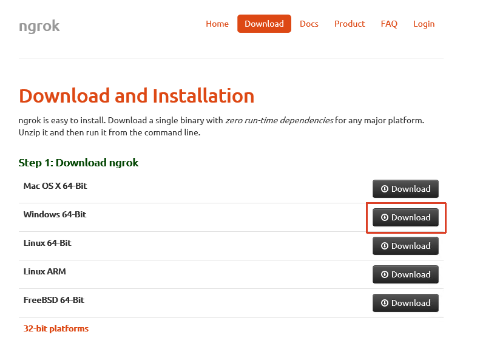

You have now installed all the necessary components to start developing a bot on your machine.

---
## Exercise 2: Create an interactive dialog<a name="ex2"></a>

We are using the [FormFlow](https://docs.microsoft.com/en-us/bot-framework/dotnet/bot-builder-dotnet-formflow) template to create our bot. The template let's you define a number of properties, including ones based on enums, that the bot will automatically gather from the user. We can even modify the text the bot uses to prompt the user and simply add regular expressions that are verified by the bot.

1. Open Visual Studio and load the `CityPowerBot.sln` from the `start` folder.

1. Open the `CityPowerBot` -> `Dialogs` -> `BasicForm.cs` and add the following code which will create a property for each value of our incident report. It will also let the bot introduce itself and greet the user with its own name. The order of the interaction is determined by the `FormBuilder` in the `BuildForm` method.

    ```csharp
    using Microsoft.Bot.Builder.Dialogs;
    using Microsoft.Bot.Builder.FormFlow;
    using Microsoft.Bot.Builder.FormFlow.Advanced;
    using System;
    using System.Collections.Concurrent;
    using System.Collections.Generic;
    using System.Globalization;
    using System.IO;
    using System.Linq;
    using System.Reflection;
    using System.Threading;
    #pragma warning disable 649

    namespace CityPowerBot
    {
        public enum IncidentTypes { GasLeak = 1, StreetLightStaysOn };
        
        // For more information about this template visit http://aka.ms/azurebots-csharp-form
        [Serializable]
        public class BasicForm
        {
            [Prompt("What is your {&}?")]
            public string FirstName { get; set; }

            [Prompt("And your {&}?")]
            public string LastName { get; set; }

            [Prompt("What type of outage would you like to report? {||}")]
            public IncidentTypes IncidentType { get; set; }

            [Prompt("Is this issue an {&}? {||}")]
            public bool Emergency { get; set; }

            [Prompt("Please give a {&} of the problem.")]
            public string Description { get; set; }
            
            [Pattern(@"(<Undefined control sequence>\d)?\s*\d{3}(-|\s*)\d{4}")]
            [Prompt("What is the {&} where we can currently reach you?")]
            public string PhoneNumber { get; set; }

            [Prompt("In which {&} do you live?")]
            public string City { get; set; }

            [Prompt("And in which state {&}?")]
            public string State { get; set; }

            [Prompt("Lastly, what {&} do you live on?")]
            public string Street { get; set; }

            [Pattern(@"^\d{5}(?:[-\s]\d{4})?$")]
            [Prompt("What is your {&}?")]
            public string ZipCode { get; set; }
            
            public static IForm<BasicForm> BuildForm()
            {
                // Builds an IForm<T> based on BasicForm
                return new FormBuilder<BasicForm>()
                    .Message("I am the City Power Bot! You can file a new incident report with me :-)")
                    .Field(nameof(FirstName))
                    .Field(nameof(LastName))
                    .Message("Hello {FirstName} {LastName}! Let's file your report!")
                    .Field(nameof(Emergency))
                    .Field(nameof(IncidentType))
                    .Field(nameof(Description))
                    .Field(nameof(City))
                    .Field(nameof(State))
                    .Field(nameof(ZipCode))
                    .Field(nameof(Street))
                    .Field(nameof(PhoneNumber))
                    .Build();
            }

            public static IFormDialog<BasicForm> BuildFormDialog(FormOptions options = FormOptions.PromptInStart)
            {
                // Generated a new FormDialog<T> based on IForm<BasicForm>
                return FormDialog.FromForm(BuildForm, options);
            }
        }
    }
    ```

    Note how we can use the `IncidentTypes` enum and the boolean property `Emergency`. The `FormBuilder` will automatically turn these types into choices presented to the user. Two regular expressions check the format of the `PhoneNumber` and `ZipCode` properties.
    
1. Let's test the new bot. Hit `F5` to start the debugging process. The Internet Explorer will open and display bot information. Note the address.

1. Start the `Bot Framework Emulator`.

1. As the endpoint URL enter your bot's address followed by `/api/messages`. It should look similar to `http://localhost:3979/api/messages`. Since we are debugging locally you can ignore the textboxes for `Microsoft App ID`, `Microsoft App Password`, and `Locale` and just click the `CONNECT` button.

    

1. The `Log` section in the lower right corner will inform you, that you are now connected to your bot.

1. Enter any text in the message window to start the dialog with your bot. It will then start to prompt you for incident details.

    

1. During your interaction you can use command words like `back`, `quit`, `reset`, `status` and `help`.

    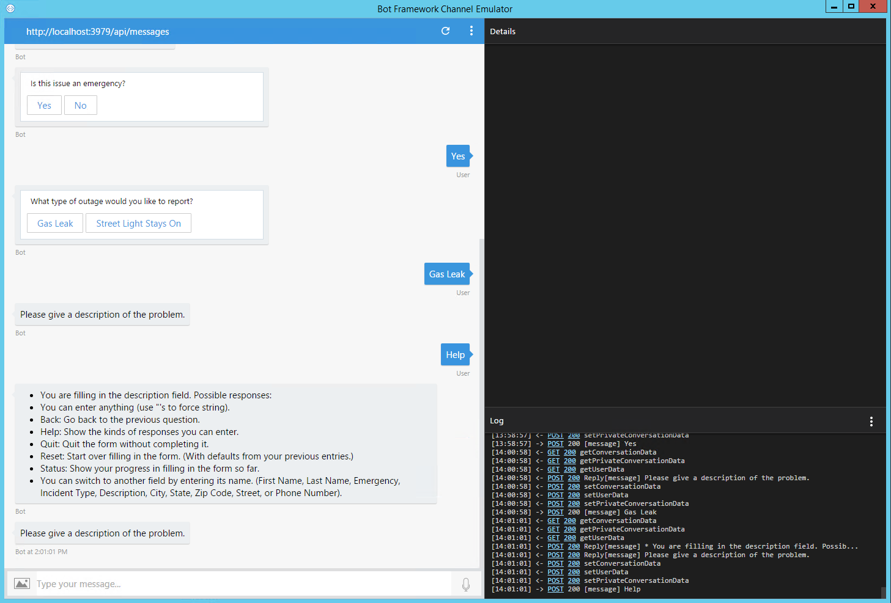

You have now created a rudimentary bot that gathers all the data we need for an incident report from the user using the [FormFlow](https://docs.microsoft.com/en-us/bot-framework/dotnet/bot-builder-dotnet-formflow) template which does most of the work for you. Next you will extend the bot to also accept an image for the report. 

---
## Exercise 3: Send attachments to the bot<a name="ex3"></a>

Did you notice the image button next to the message window? You can not only send text messages to your bot but also image files. Let's tell the bot how to handle them.
    
1. In the `CityPowerBot` -> `Controllers` -> `MessagesController.cs` replace the creation of the `MainDialog` with a switch that filters messages containing images while letting the existing `MainDialog` handle all the other messages.

    ```csharp
    if (activity.Type == ActivityTypes.Message)
    {
        // Stores send images out of order.
        var connector = new ConnectorClient(new Uri(activity.ServiceUrl));
        var imageAttachment = activity.Attachments?.FirstOrDefault(a => a.ContentType.Contains("image"));
        if (imageAttachment != null)
        {
            LastImage = await GetImageStream(connector, imageAttachment);
            LastImageName = imageAttachment.Name;
            LastImageType = imageAttachment.ContentType;
            Activity reply = activity.CreateReply("Got your image!");
            await connector.Conversations.ReplyToActivityAsync(reply);
        }
        else
        {
            // Creates a dialog stack for the new conversation, adds MainDialog to the stack, and forwards all messages to the dialog stack.
            await Conversation.SendAsync(activity, () => new MainDialog());
        }
    }
    ```

1. Add these two methods that will extract a stream from the image send by the user.

    ```csharp
    private static async Task<Stream> GetImageStream(ConnectorClient connector, Attachment imageAttachment)
    {
        using (var httpClient = new HttpClient())
        {
            // The Skype attachment URLs are secured by JwtToken,
            // you should set the JwtToken of your bot as the authorization header for the GET request your bot initiates to fetch the image.
            // https://github.com/Microsoft/BotBuilder/issues/662
            var uri = new Uri(imageAttachment.ContentUrl);
            if (uri.Host.EndsWith("skype.com") && uri.Scheme == "https")
            {
                httpClient.DefaultRequestHeaders.Authorization = new AuthenticationHeaderValue("Bearer", await GetTokenAsync(connector));
                httpClient.DefaultRequestHeaders.Accept.Add(new MediaTypeWithQualityHeaderValue("application/octet-stream"));
            }

            return await httpClient.GetStreamAsync(uri);
        }
    }

    /// <summary>
    /// Gets the JwT token of the bot. 
    /// </summary>
    /// <param name="connector"></param>
    /// <returns>JwT token of the bot</returns>
    private static async Task<string> GetTokenAsync(ConnectorClient connector)
    {
        var credentials = connector.Credentials as MicrosoftAppCredentials;
        if (credentials != null)
        {
            return await credentials.GetTokenAsync();
        }

        return null;
    }
    ```

    The code will store the last submitted image in the variables to be used when the report is submitted.

1. Now we have to tell the users that they can send images along with their incident reports. Open the `CityPowerBot` -> `Dialogs` -> `BasicForm.cs` and in the `BuildForm` method add this additional message right after the first message your bot sends:

    ```csharp
    .Message("Did you know? At any point during our conversation you can send me an image that I will attach to your report.")
    ```

1. Hit `F5` to start the debugging process and talk to your bot via the `Bot Framework Emulator`. Note that the bot is informing you about its new capability. During the interaction click the image button and send an image from your machine. The bot will confirm that it "got your image".

    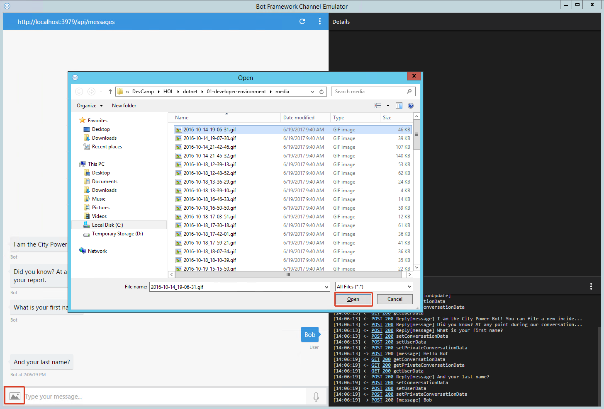
    
    The DevCamp folder contains many images that you can use to test the feature.
    
    

    Sending the image will not affect the rest of your conversation with the bot.

Your bot now accepts and stores an image send by the user. Now that you have everything that can be submitted in an incident report you are going to send it to the incident API.

---
## Exercise 4: Integrate the API<a name="ex4"></a>

To file the reported incident we use the incident API. The necessary methods are present in the `DataWriter` project. The project contains excerpts from the previous hands on labs. The code was shortened to just create an incident and upload the attached image. To complete it you have to add your Azure account information. 

1. Open `DataWriter` -> `IncidentController.cs` and replace `YOUR INCIDENT API URL` with the URL of your incident API which you retrieved in [HOL 2 exercise 1]((../02-modern-cloud-apps)#ex1) and looks similar to `http://incidentapi[...].azurewebsites.net`.

1. Open `DataWriter` -> `StorageHelper.cs` and replace `YOUR AZURE BLOB STORAGE` with the **Storage account name** and `YOUR AZURE BLOB STORAGE ACCESS KEY` with the **key1** you retrieved in [HOL 2 exercise 3]((../02-modern-cloud-apps)#ex3). You have stored these values in the environment variables of the previous lab's code.

1. Now that the `DataWriter` project is prepared we will call its `Create` method after we got all the data from the user. Open `CityPowerBot` -> `Dialogs` -> `BasicForm.cs` and add the following `OnCompletionAsyncDelegate` declaration at the beginning of the `BuildForm` method before the `return`:

    ```csharp
    OnCompletionAsyncDelegate<BasicForm> processReport = async (context, state) =>
    {
        await context.PostAsync("We are currently processing your report. We will message you the status.");
        if (await DataWriter.IncidentController.CreateAsync(state.FirstName, state.LastName, state.Street, state.City, state.State, state.ZipCode, state.PhoneNumber, state.Description, state.IncidentType.ToString(), state.Emergency, MessagesController.LastImage, MessagesController.LastImageName, MessagesController.LastImageType))
        {
            await context.PostAsync("The incident report has been logged.");
        }
        else
        {
            await context.PostAsync("An error occured logging the incident.");
        }
    };
    ```

1. We are going to let the users confirm that they want to submit the entered data using the template's confirm feature. If the user replies with `No` the input can be changed before it is submitted. Again the [FormFlow](https://docs.microsoft.com/en-us/bot-framework/dotnet/bot-builder-dotnet-formflow) template does all of the work for you. Once we get the confirmation we can process the incident report by sending it to our incident API. Add the `Confirm` and `OnCompletion` calls to the end of the form builder chain before the `Build()` call:

    ```csharp
    .Field(nameof(PhoneNumber))
    
    .Confirm(async (state) =>
    {
        return new PromptAttribute($"OK, we have got all your data. Would you like to send your incident report now?");
    })
    .OnCompletion(processReport)
    
    .Build();
    ```

1. Hit `F5` to start the debugging process and talk to your bot via the `Bot Framework Emulator`.

1. Answer all the bot's questions and confirm that you want to send the incident report.

    

1. In another browser tab, open the Dashboard of the City Power site you deployed in the previous hands on labs to check that your new incident has been logged. You can also run a local copy of your code from another instance of Visual Studio to run the City Power site.

    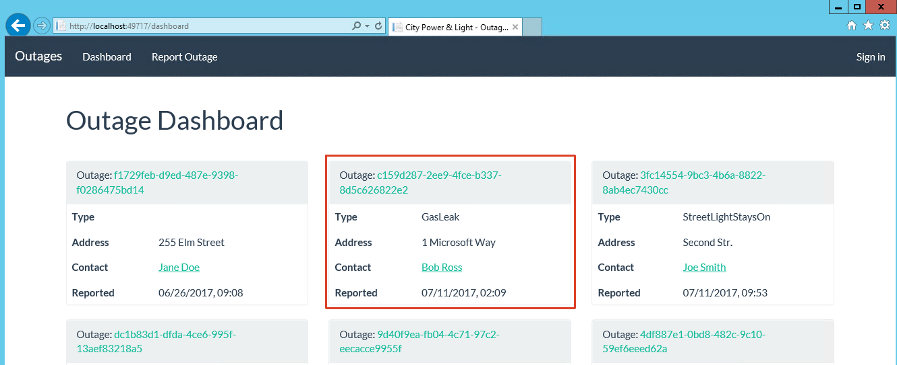

1. Use the Azure Storage Explorer like you did in [HOL 2 exercise 3]((../02-modern-cloud-apps)#ex3) to check that the image you attached was uploaded to the blob storage. You can double-click the image to open it in a new window.    

    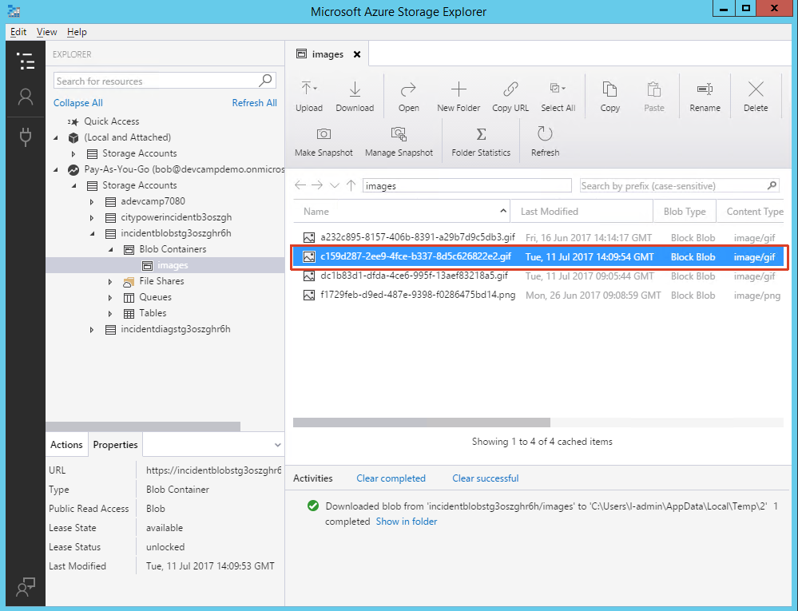

Your bot is finished. It gathers and uploads data to create a new incident report. Next you are going to deploy it to Azure to make it globally accessible.

---
## Exercise 5: Host your bot in Azure<a name="ex5"></a>

To make our bot accessible we have to publish it in a public location. An Azure app is idealy suited for this. We will let Visual Studio do the publishing and automatically create a new Azure app in our resource group to host the bot. Once the Visual Studio publishing wizard has done this we will register the bot in the [Bot Framework Portal](https://dev.botframework.com/bots) and add the generated IDs to our `Web.config`.

1. If your bot is still running, stop it. In Solution Explorer, right-click on the `CityPowerBot` project and select `Publish`. This starts the Microsoft Azure publishing wizard.

    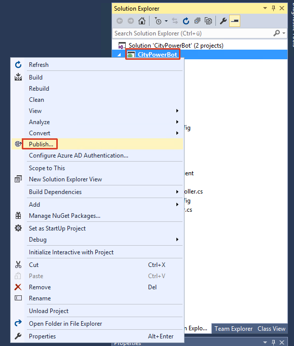

1. Select `Microsoft Azure App Service` which will open the App Service dialog.

    

1. Select the `DevCamp` resource group and click `New...`. 

    

1. Accept the defaults and click `Create`.

    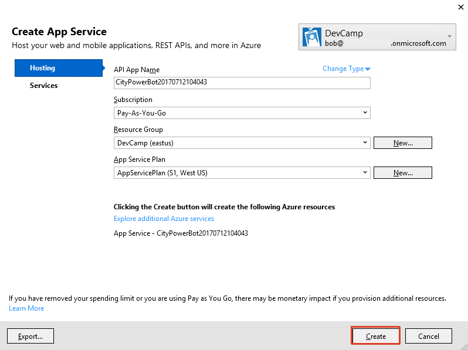

1. Note the `Destination URL` value (you'll need this value later to test the connection to the bot), and then click `Validate Connection` to verify that the settings have been configured correctly. If validation is successful, click `Next`.

    

1. By default, your bot will be published in a `Release` configuration. (If you want to debug your bot, change `Configuration` to `Debug`.) Click `Publish` to publish your bot to Microsoft Azure.

    

1. Open a browser and navigate to the [Bot Framework Portal](https://dev.botframework.com/bots). After you sign in, click `Create`:

    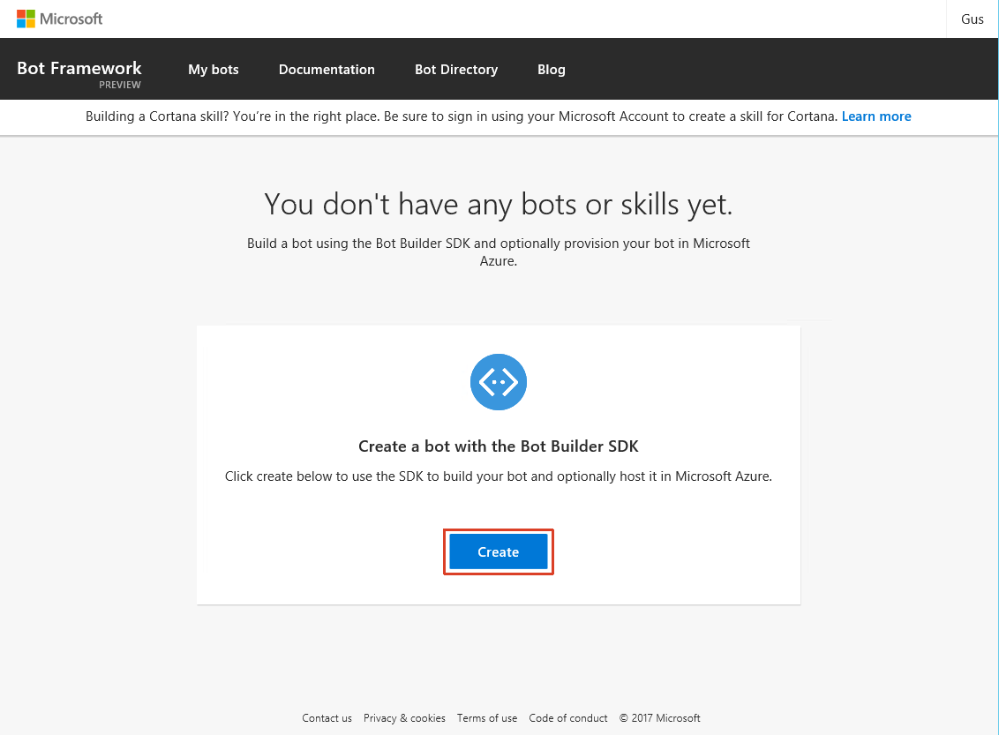

1. In the dialog select `Register an existing bot using Bot Builder SDK` and click `Ok`:

    

    **Complete the Bot profile section of the form.**

    1. Optionally upload an icon that will represent your bot in the conversation.
    1. Provide your bot's `Display Name`. When users search for this bot, this is the name that will appear in the search results.
    1. Provide your bot's `Handle`. This value will be used in the URL for your bot and cannot be changed after registration.
    1. Provide a `Description` of your bot. This is the description that will appear in search results, so it should accurately describe what the bot does.

    **Complete the Configuration section of the form.**

    1. Provide your bot's HTTPS messaging endpoint. This is the endpoint where your bot will receive HTTP POST messages from Bot Connector. Use the `Destination URL` you noted earlier and add `https` and `/api/messages`. It should look similar to this: `https://citypowerbot20170712104043.azurewebsites.net/api/messages`.
        
        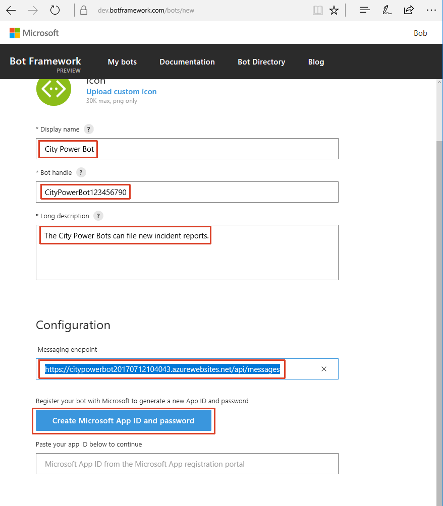

    1. Click `Create Microsoft App ID and password`.
        * Note the App ID.
        * On the next page, click `Generate an app password to continue`.
        * Copy and securely store the password that is shown, and then click `Ok`.
        * Click `Finish and go back to Bot Framework`.
        * Back in the Bot Framework Portal, the `App ID` field is now populated.
        
        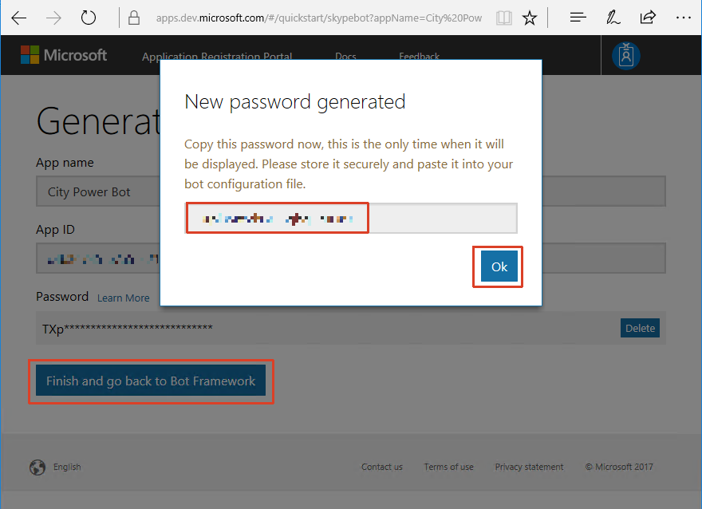

    **Complete the Admin section of the form.**

    1. Specify the email address(es) for the Owner(s) of the bot.

    1. Check to indicate that you have read and agree to the Terms of Use, Privacy Statement, and Code of Conduct.

    1. Click `Register` to complete the registration process.

    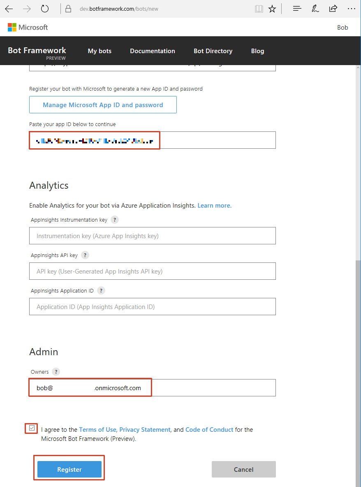

1. In Visual Studio, open the `CityPowerBot` -> `Web.config` and enter the values you just gathered for the `BotId` (the bot's `Handle` you entered during the registration process), `MicrosoftAppId` and `MicrosoftAppPassword` in the `appSettings` section.

    ```charp
    <appSettings>
        <!-- update these with your BotId, Microsoft App Id and your Microsoft App Password-->
        <add key="BotId" value="YourBotId" />
        <add key="MicrosoftAppId" value="" />
        <add key="MicrosoftAppPassword" value="" />
    </appSettings>
    ```

1. In Solution Explorer, right-click on the `CityPowerBot` project and select `Publish`. This starts the Microsoft Azure publishing wizard. Click `Publish` to publish the changes.

    

1. Verify the deployment of your bot by using the `Bot Framework Emulator`. You have to configure `ngrok` to connect to your Azure hosted bot. Click the three dots and select `App Settings`to open the settings dialog.

    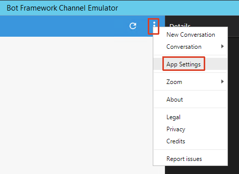

1. In the dialog select the `ngrok.exe` file you extracted to your Desktop in the first exercise, check the `Use version 1.0 authentication tokens` option and click `SAVE` to close the dialog.

    

1. Enter the bot's HTTPS endpoint into the address bar of the Emulator. It should look similar to this: `https://citypowerbot20170712104043.azurewebsites.net/api/messages`. Also provide the `Microsoft App ID` and the `Microsoft App Password` you noted earlier. Then click `CONNECT`. Test your bot as before.

    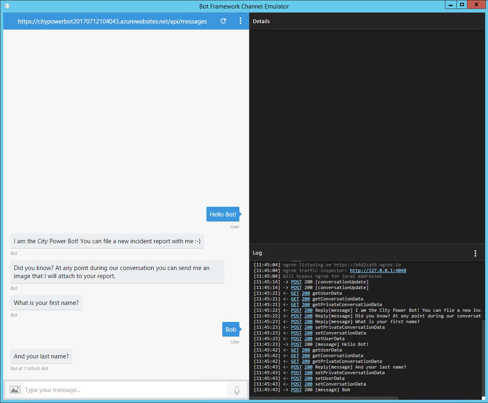

    > If you get a Server 500 error message try removing the `Microsoft App ID` and the `Microsoft App Password` and reconnect to the bot.

1. If you like you can now [configure the bot](https://docs.microsoft.com/en-us/bot-framework/portal-configure-channels) to run on one or more channels.

You have now manually created a bot and uploaded it to Azure. An alternative way of creating a bot is using the Azure Bot Service.

---
## Exercise 6: Azure Bot Service<a name="ex6"></a>

You have seen some of the basics of bot development. In the exercises you have used the [FormFlow](https://docs.microsoft.com/en-us/bot-framework/dotnet/bot-builder-dotnet-formflow) template to create the interaction between the user and the bot. Many other templates are available. You can also use [Azure Bot Service](https://docs.microsoft.com/en-us/bot-framework/azure/azure-bot-service-overview) to quickly create a bot from within the Azure portal.

1. To create a bot using the Azure Bot Service navigate to the DevCamp resource group and click `Add`. Enter `Bot Service` in the filter box, then select the `Bot Service (Preview)` and click `Create` on the details blade.

    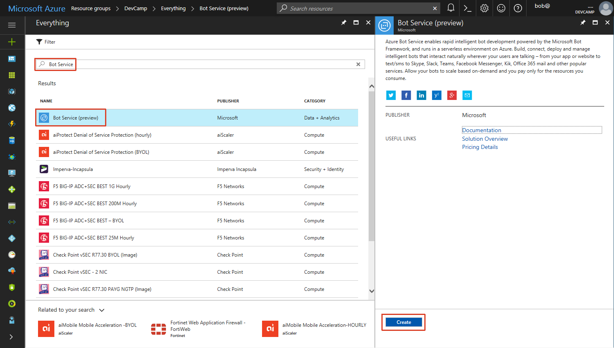

1. Enter a name for your bot and click `Create` again.

    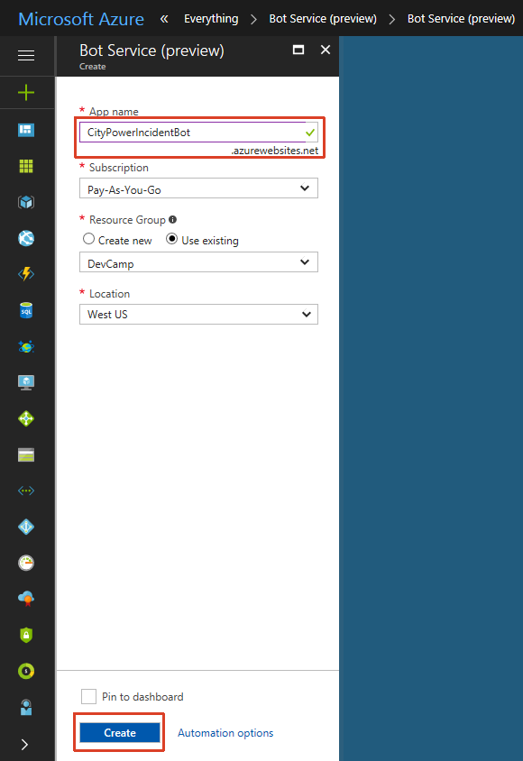

1. Navigate to the bot in your resource group. You will be redirected to the template blade. Now you can select your preferred programming language and the template you want to use for your bot. Choose the `Form` to end up with a bot that is again based on the [FormFlow](https://docs.microsoft.com/en-us/bot-framework/dotnet/bot-builder-dotnet-formflow) template and click `Next`.

    

1. Click `Manage Microsoft App ID and password` and create a new id for your bot. Copy the App Id and the password to the template blade, check and agree to the Terms of Use and click `Create bot`.

    

1. The deployment will take some minutes.

    
    
1. You can find more information on the templates and their application [here](https://docs.microsoft.com/en-us/bot-framework/azure/azure-bot-service-overview).

1. You can now develop and test your bot directly within the Azure Portal but should configure continuous integration to be able to add additional files. If you make changes to the code you might have to reload the page for the test section to show the changes. Your new bot is also available via the [Bot Framework Portal](https://dev.botframework.com/bots). You can use a second browser window to test the bot in the Bot Framework Portal.

1. When you follow the guide provided by Azure to enable continuous integration using what you learned in [HOL 4](../04-devops-ci) you will need to download a project file to run your bot's downloaded code in a local Visual Studio (2015) installation. (See [this guide](https://docs.microsoft.com/en-us/bot-framework/azure/azure-bot-service-debug-bot#a-iddebug-csharpa-debug-a-c-bot) which wrongly states that you don't need the file for Visual Studio 2015). Place the [downloaded project file](https://aka.ms/bf-debug-project) in the `messages` folder before you continue.

    1. Run `dotnet restore` on the same folder.

        
    
    1. Follow the guide and install [Azure Functions CLI](https://www.npmjs.com/package/azure-functions-cli).
    
        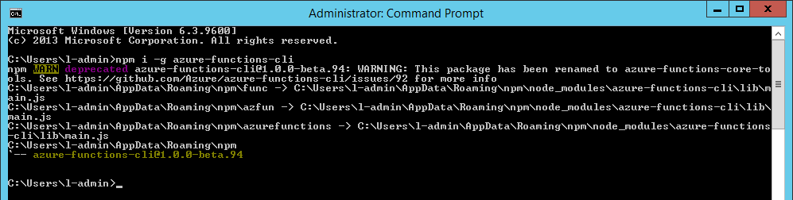
    
    1. And also [DotNet CLI](https://github.com/dotnet/cli).
    
        
    
    1. And finally the [Command Task Runner Visual Studio Extension](https://visualstudiogallery.msdn.microsoft.com/e6bf6a3d-7411-4494-8a1e-28c1a8c4ce99).
    
        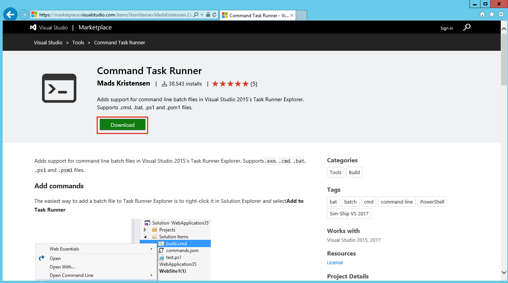
    
    1. Now start Visual Studio and add the reference `, "Microsoft.Bot.Connector": "1.1.0"` to the `project.json` file.
    
        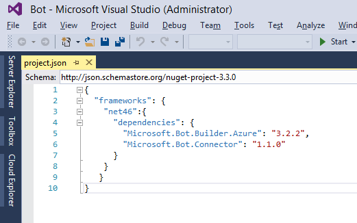

    1. Your downloaded bot code created by the Azure Bot Service should now compile and you can also use the `Bot Framework Emulator` to debug it locally.

You have now seen an alternative way to create and debug a bot using the Azure Bot Service. A basic bot can be created completely without a development environment.

---
## Summary

In this hands-on lab, you learned how to:
* Set up the developing environment to support the creation of bot applications.
* Create your own bot from scratch.
* Create your own bot using Azure Bot Service.
* Hosting your bot in Azure.

After completing this module, you can continue on to Module 9: IoT.

### View Module 9 instructions for [Node.JS](../11-IoT/)
---
Copyright 2017 Microsoft Corporation. All rights reserved. Except where otherwise noted, these materials are licensed under the terms of the MIT License. You may use them according to the license as is most appropriate for your project. The terms of this license can be found at https://opensource.org/licenses/MIT.